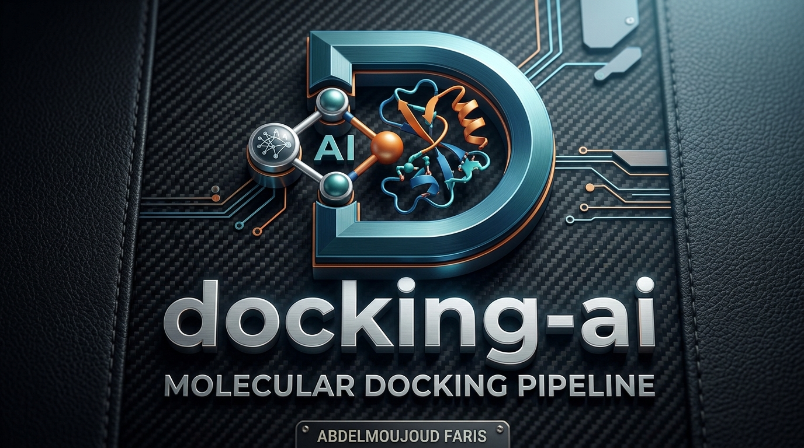
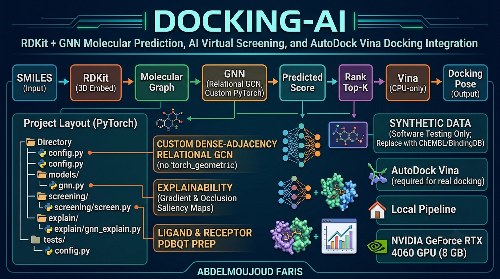

# docking-ai

<p align="left">
  <a href="img/logo.png" target="_blank">
    
  </a>
</p>

RDKit + GNN molecular property prediction, AI-driven virtual screening, and an
AutoDock Vina docking integration, built as a single local pipeline:

```
SMILES --RDKit--> molecular graph --GNN--> predicted score --rank--> top-K --Vina--> docking pose
```

<p align="center">
  <a href="img/pepline.png" target="_blank">
    
  </a>
</p>
<p align="center"><sub>Click the diagram to view full size</sub></p>

## Project layout

```
Pytroch/
  src/docking_ai/
    config.py           paths, RANDOM_SEED, VINA_PATH
    data/
      molecules.py       RDKit SMILES -> atom/bond graph tensors
      dataset.py          PyTorch Dataset, Bemis-Murcko scaffold split, padding/collate
      sample_data.py      bundled example molecules + SYNTHETIC labels (see below)
    models/gnn.py         relational GCN (dense-adjacency, no torch_geometric dependency)
    training/
      train.py            training loop, early stopping, checkpointing
      metrics.py           regression + classification metrics
    evaluation/evaluate.py  checkpoint -> metrics report + plot
    docking/
      ligand_prep.py       RDKit 3D embed + meeko -> ligand PDBQT
      receptor_prep.py     receptor PDBQT validation + search-box-from-ligand helper
      vina_wrapper.py       subprocess wrapper around the `vina` executable
    screening/screen.py    GNN-ranked virtual screening, optional Vina re-scoring of top-K
    explain/gnn_explain.py  gradient and occlusion atom-importance + 2D rendering
  tests/                  pytest suite (28 tests, one per module/behavior)
  examples/               runnable, no-download-needed demo scripts (see examples/README.md)
  configs/default.yaml    documents TrainConfig fields for config-file-driven runs
  data/                   raw/processed data (empty; see "Using real data" below)
  outputs/                logs, checkpoints, docking/screening/explain artifacts (gitignored)
```

## Setup

A virtual environment already exists at `.venv/` (created with
`--system-site-packages`, so it reuses your existing global installs of numpy,
pandas, rdkit, torch, scikit-learn, and adds project-specific packages:
matplotlib, networkx, meeko, pyyaml, tqdm, pytest). The package itself is
installed editable (`pip install -e .`).

To set it up from scratch elsewhere:

```powershell
cd C:\Users\faris-c\Documents\APK\Pytroch
python -m venv .venv --system-site-packages
.\.venv\Scripts\python.exe -m pip install -e ".[dev]"
```

or via conda: `conda env create -f environment.yml`.

## Running things

```powershell
cd C:\Users\faris-c\Documents\APK\Pytroch

# compile check + full test suite
.\.venv\Scripts\python.exe -m compileall src
.\.venv\Scripts\python.exe -m pytest -q

# train a model on the bundled example dataset (regression on synthetic_score)
.\.venv\Scripts\python.exe -m docking_ai.training.train
```

Runnable, no-download-needed demos for every stage (training, evaluation,
screening, explainability, ligand prep) live in `examples/` -- see
`examples/README.md`.

For evaluation / screening / explainability, use the library from a script or
notebook, e.g.:

```python
from docking_ai.data.sample_data import build_synthetic_dataset
from docking_ai.training.train import TrainConfig, train
from docking_ai.screening.screen import score_library
from docking_ai.explain.gnn_explain import explain_molecule, render_atom_importance

df = build_synthetic_dataset()
result = train(df=df, cfg=TrainConfig(run_name="my_run"))
ranked = score_library(result["checkpoint_path"], df["smiles"].tolist())
top = ranked.iloc[0]
exp = explain_molecule(result["checkpoint_path"], top["smiles"], method="gradient")
render_atom_importance(exp["smiles"], exp["atom_importances"], "outputs/explain/top_hit.png")
```

## SCIENTIFIC INTEGRITY: what the bundled data actually is

There is no real bioactivity/binding-affinity dataset bundled with this
project. `docking_ai.data.sample_data.build_synthetic_dataset()` returns ~77
**real** molecules (common drugs, metabolites, simple aromatics/aliphatics)
but their regression/classification labels (`synthetic_score`,
`synthetic_active`) are a fixed linear combination of real RDKit descriptors
plus fixed-seed Gaussian noise:

```
SYNTHETIC DATA — SOFTWARE TESTING ONLY
```

This exists purely so training/evaluation/screening/explainability have
something concrete to run against end-to-end. **Do not** interpret any
metric, ranking, or docking score produced against this dataset as a real
biological or pharmacological claim.

### Using real data

Replace `build_synthetic_dataset()` with a loader that returns a DataFrame
with a `smiles` column and your real label column (e.g. pIC50, Ki, a binary
active/inactive call from an assay) -- for example an extract from ChEMBL,
BindingDB, PubChem BioAssay, or your own measured data. Everything downstream
(`MoleculeDataset`, `scaffold_split`, `train`, `evaluate_checkpoint`,
`score_library`) only assumes that `(smiles, label)` schema.

## AutoDock Vina setup (required for real docking)

AutoDock Vina is **not installed** and could not be auto-installed:
`pip install vina` has no Windows wheel and fails building from source
(missing Boost). `nvidia-smi`/PyTorch checks confirm this environment does
have an RTX 4060 GPU, but Vina itself is CPU-only software, so that's
unrelated.

To enable real docking:

1. Download a Vina release binary for Windows:
   https://github.com/ccsb-scripps/AutoDock-Vina/releases
2. Either put `vina.exe` on your `PATH`, or set an environment variable:
   `$env:VINA_PATH = "C:\path\to\vina.exe"`
3. Prepare a receptor PDBQT yourself with ADFRsuite's `prepare_receptor`
   (https://ccsb.scripps.edu/adfr/) or MGLTools `prepare_receptor4.py`. This
   project deliberately does **not** auto-generate receptor PDBQT files from
   raw PDBs -- protonation states, missing loops/residues, waters, cofactors,
   and metal ions require structural-biology judgment calls that shouldn't be
   silently automated.
4. `docking_ai.docking.receptor_prep.box_from_ligand()` can derive a search
   box from a reference/co-crystallized ligand structure file.
5. `docking_ai.docking.vina_wrapper.run_vina()` (or
   `docking_ai.screening.screen.dock_top_k()` to dock the top-K GNN hits)
   shells out to the `vina` executable and parses its pose/affinity table.

Until Vina is installed, `find_vina_executable()` / `run_vina()` /
`dock_top_k()` raise `DockingUnavailableError` with these same instructions,
rather than fabricating a result. `tests/test_docking.py` and
`tests/test_screening.py` assert this fail-fast behavior (and auto-skip if
Vina happens to be present).

Ligand preparation (SMILES -> 3D -> PDBQT) *does* work today, with no
external binary needed, via RDKit conformer embedding + MMFF/UFF optimization
+ `meeko`.

## Environment detected / decisions made

- Python 3.12.7, global site-packages already had numpy 2.4.6, pandas 3.0.5,
  rdkit 2026.3.5, torch 2.13.0, scikit-learn 1.9.0 -- the venv was created
  with `--system-site-packages` to reuse these rather than re-downloading.
- GPU: NVIDIA GeForce RTX 4060 (8 GB), driver reports CUDA 13.3, **but the
  installed torch build is CPU-only** (`torch.cuda.is_available() == False`).
  Reinstalling a CUDA-enabled torch wheel was not done automatically (multi-GB
  download, and the bundled example dataset is small enough that CPU training
  finishes in seconds). If you want GPU training for a larger real dataset,
  install a matching CUDA build, e.g.:
  `.\.venv\Scripts\python.exe -m pip install torch --index-url https://download.pytorch.org/whl/cu126`
  (check https://pytorch.org/get-started/locally/ for the wheel matching your
  driver/torch version), then pass `device="cuda"` in `TrainConfig`.
- GNN implementation is a custom dense-adjacency relational GCN (one learned
  transform per bond type: single/double/triple/aromatic), not
  torch_geometric -- this avoids a fragile Windows install (torch-scatter /
  torch-sparse wheel matching) for a project working with small, drug-like
  molecules where dense adjacency is entirely adequate.
- Explainability uses hand-rolled gradient*input saliency and leave-one-atom
  occlusion (no captum/shap dependency) -- both are standard, easy-to-verify
  attribution methods and keep the dependency surface small.

## Tests

`pytest` (28 tests) covers: RDKit featurization shapes/symmetry/invalid-input
handling, dataset padding/collation, scaffold split (asserts zero scaffold
leakage across train/val/test), GNN forward-pass shapes and padding-invariance
and gradient flow, a training smoke test for both regression and
classification (asserts the loss actually decreases), evaluation report/plot
generation, ligand PDBQT preparation, receptor PDBQT validation, Vina
fail-fast behavior, virtual-screening ranking, and both explainability
methods including image rendering.

```powershell
.\.venv\Scripts\python.exe -m pytest -q
```

## Files to commit to GitHub vs. keep local

Commit: everything under `src/`, `tests/`, `examples/`, `configs/`, `pyproject.toml`,
`requirements.txt`, `environment.yml`, `.gitignore`, `README.md`, and the
`.gitkeep` placeholders under `data/`.

Keep local / do not commit (already covered by `.gitignore`): `.venv/`,
`outputs/` (checkpoints, logs, docking results, explanation images -- all
regenerable by re-running training/evaluation), any real dataset you place
under `data/raw/` or `data/processed/` (may be subject to a data-use license
you don't have redistribution rights for), and anything under `__pycache__/`
or `*.egg-info/`.

No GitHub remote was created or pushed to, per instructions -- that step is
left for you to do manually.
